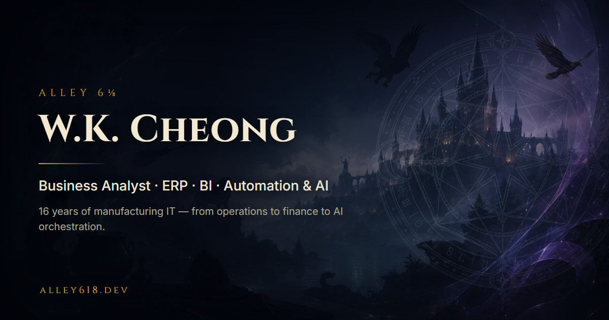
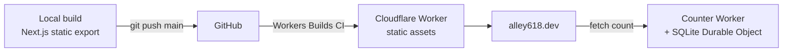

# Alley 6⅛ — A Wizard's Journey into AI

**🟢 Live: [alley618.dev](https://alley618.dev)**

A cinematic, scroll-driven, single-page portfolio. Instead of a flat resume, it tells a
16-year story — from manufacturing IT operations in Malaysia to AI orchestration — through
seven animated scenes set in a night alley: an owl delivers the portrait, a quill writes
the career journey, spell books open into project write-ups, and a spider spins the
contact links into its web.

> **Where's the source?** The application code is in a private repository by choice —
> this repo is the project's public write-up: what it is, how it's built, and the
> engineering problems solved along the way. The best demo is the site itself.

## The seven scenes

| # | Scene | What happens |
|---|-------|--------------|
| 1 | **Who** | Smoke intro over a WebGL starfield; an owl flies the portrait into a vine ring; the cursor becomes a wand |
| 2 | **Journey** | A scroll unrolls the 16-year career path; year-carrier brooms fly in, a quill writes each entry |
| 3 | **Hall of Honors** | Four honor pots bubble and smoke; certification cards rise out of them |
| 4 | **Spell Books** | A floating library; Volume 1 flips open into a zoomed spread telling how this site was built |
| 5 | **AI Portal** | Press the seal: 23 AI/tool logos fly out into a living knowledge graph with a windy, breathing drift |
| 6 | **Contact** | A briefcase drops and opens, a letter flies out, parchment unrolls — then a spider drops and spins the four contact links as webs |
| 7 | **Scoreboard** | A wooden board with parchment flip-plates showing the real, live visit count |

## Stack & architecture

**Frontend:** Next.js 15 (static export) · React 19 · TypeScript · Tailwind CSS v4 ·
framer-motion · Three.js via @react-three/fiber

**Infrastructure:** Cloudflare Workers — one Worker serves the static build on
`alley618.dev`; a second Worker with a SQLite-backed Durable Object provides the atomic
visit counter. Push to `main` triggers Cloudflare Workers Builds (`npm ci` → `next build`
→ `wrangler deploy`), so a broken commit can never take the live site down.

## Engineering highlights

**Performance is a budget, not a hope.** First Load JS is **173 kB (219.9 KB gzip)**
against a hard 250 KB budget. The QA pass caught it at 443.6 KB; the fix was surgical —
splitting the starfield so the SSR-visible artwork stays in the static HTML while the
heavy three/fiber code lazy-loads. Runtime budgets are equally explicit: one WebGL
context, capped particle counts, DPR ≤ 1.5, transform/opacity-only animation loops, and
**zero layout shift from any animation**.

**Typography that cannot overflow.** A fixed-pixel font inside a percentage-scaled art
panel is a latent bug: the panel shrinks with the viewport, the type doesn't, and the
narrower column wraps into *more* lines — it broke on every phone under ~400 px while
passing QA at 390 px by 1.2 px. The fix sizes the book type in container-query units
(`cqw`), making the line count width-invariant: it can never overflow again, it only
scales down.

**Verification you can trust.** Every interaction ships only after a headless-Chrome CDP
probe drives real clicks, focus, and scrolls at desktop *and* mobile viewports — 162
automated checks for the contact sequence alone — and the load-bearing assertions are
mutation-tested: break the feature on purpose, confirm the check goes red, revert. A green
check you've never seen fail is not evidence. Screenshots are still human-reviewed, because
numbers passing ≠ the design is right.

**Shipping to the real internet.** Post-launch fixes that only real-world usage finds: a
portrait `og:image` rendered as a giant photo in chat apps (rebuilt as a 1200×630 JPEG
card — WebP silently breaks link previews); and a week-old domain being blocked by
corporate firewalls disguised as an SSL error — a forged Fortinet certificate on an
`Unrated` domain — fixed by submitting the domain for categorization at the filter
vendors, not by touching the server.

**Accessibility is load-bearing.** Reduced-motion users get a calm, complete site (the
intro scroll-lock never engages). Contact controls are in the DOM from first paint for
no-JS readers and assistive tech, `inert` during choreography. WCAG contrast failures
found in QA were fixed, not waived.

## How it was built

The site was built in an AI-orchestrated workflow with Claude Code: a spec suite (8 design
docs, updated *before* code every round), ~65 implementation rounds each running
brief → implement → build → CDP probe → human screenshot review, with fresh subagents per
task and two-stage review between tasks. The intensive build phase ran about **48 hours of
sessions, ~375M tokens, ≈US$497 at list rates** — the full story is on the site, inside
Spell Book Volume 1.

The design itself was iterated the same way: the spider-web contact scene was settled on
an interactive HTML mock across five review rounds *before* a line of production code was
written.

## About

**Cheong Wai Kit (W.K.)** — Business Analyst (Finance) at a Bursa Malaysia-listed
manufacturer, building AI-assisted tooling and automation. Based in Ipoh, Malaysia.

📫 Reach me through the contact scene on **[alley618.dev](https://alley618.dev)** — send
an owl.
